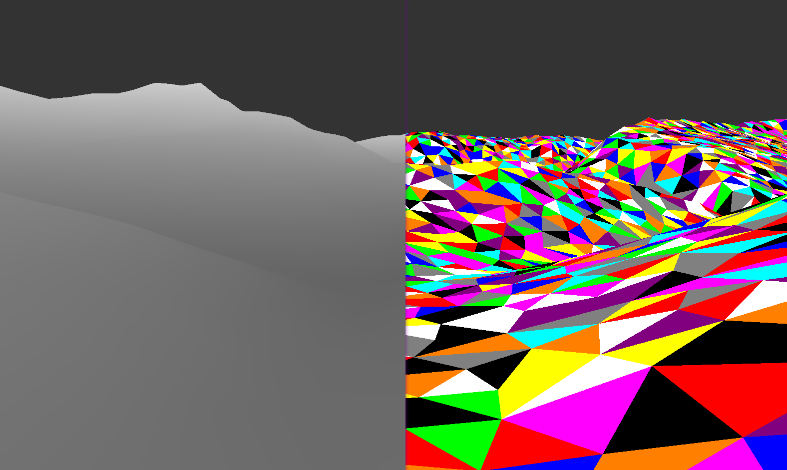

# TP de Géométrie des maillages (GAM - M2 ID3D)

Nuage de point insérer un par un avec delaunay 2D. La hauteur est d'abord ignorer puis réappliquer a la fin, ce qui donne une legère erreur topologique. 
Le terrain prend plusieurs secondes a charger a cause des tests d'appartenance au maillage, ce qui pourrait être amélioré via des test d'orientation pour trouver le bon triangle qui contient le point

## Structure de voisinnage d'un maillage

Les maillages supposé pour ce tp sont régulier et n'ont que trois voisins. Une fois charger, ils ont un calcul de voisinnage qui remplit un tableau supplémentaire contenant les trois voisins d'un triangle, 
chaque triangles voisins étant positionner dans le tableau en fonction du sommet qui ne touche pas la face.

### Itérateurs

Ceci nous permet donc de tourner autour d'un sommet et ainsi d'itérer sur toutes les faces autour d'un sommet, ainsi que sur tout les sommets autour d'un sommet. Ceci est accompli via CirculatorFacesIterator et CirculatorVertexIterator.
Ces deux itérateurs permetent d'itérer à moindre coût et de rendre l'insertion de point, le remaillage ansi que le calculs de laplacien plus facile.
Deux itérateurs plus classiques permettent aussi d'itérer linéairement sur le mesh.

## Sommet infini

Le premier sommet d'un maillage est infini et se situe sur l'axe Z visuellement. Il est relié a chaque triangle de l'enveloppe convexe (en bordure de la surface du maillage) et permet d'itérer facilement sur celle ci 
pour vérifier si un sommet doit être ajouter a l'intérieur ou à l'extérieur du maillage.

## Insertion et maillge de Delaunay

Une fonction pour transformer un mesh 2D ainsi qu'une autre pour insérer un point respectant la propriété de Delaunay local sont au coeur de ce tp et présentent dans la classe Mesh.
